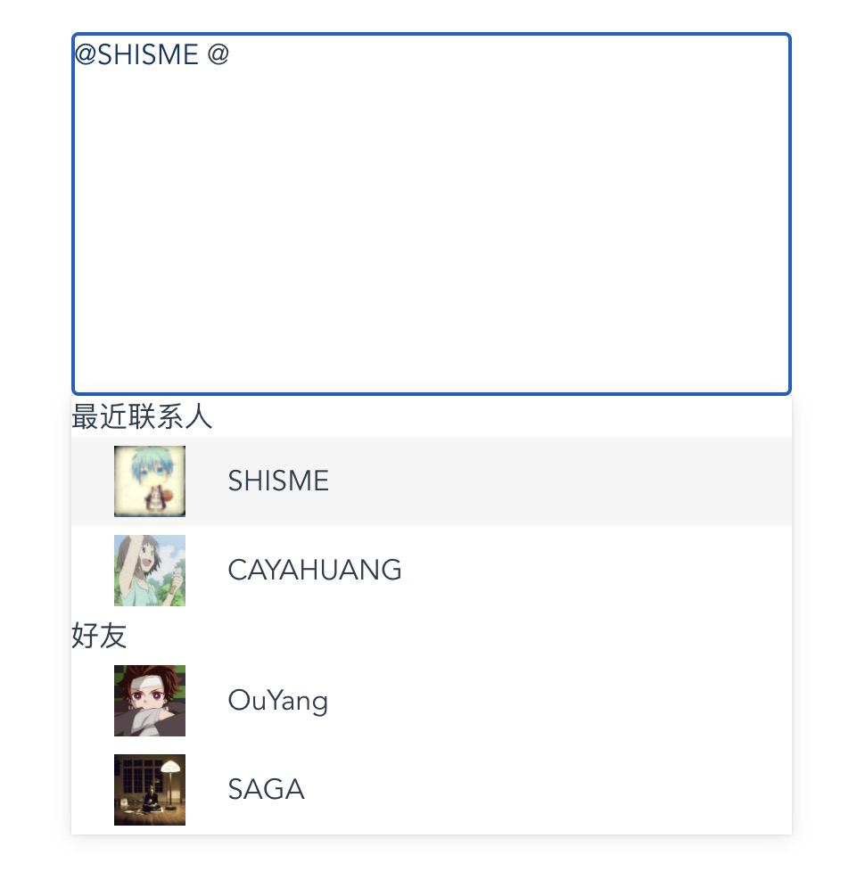

## Install

> npm install vue3-at --save

## Usage

```vue
<template>
  <vue3-at :atMap="atMap" @at="onAt" :renderTagItem="renderTagItem">
    <div class="editor" contenteditable></div>
    <template v-slot:listItem="{ item }">
      <div v-if="item.isSubjectTitle">{{ item.title }}</div>
      <div class="list-item" v-else>
        {{ item.name }}
      </div>
    </template>
  </vue3-at>
</template>

<script lang="ts">
import { defineComponent, ref } from "vue";
import { Vue3At } from "vue3-at";

export default defineComponent({
  name: "App",
  components: {
    Vue3At,
  },
  setup() {
    const atMap = ref({
      "@": {
        keyName: "name",
        list: [
          {
            isSubjectTitle: true,
            title: "最近联系人",
          },
          {
            name: "SHISME",
            userId: "",
            avatar: "https://avatars.githubusercontent.com/u/17661313?s=40&v=4",
          },
          {
            name: "CAYAHUANG",
            userId: "",
            avatar:
              "https://avatars.githubusercontent.com/u/18247969?s=100&v=4",
          },
          {
            isSubjectTitle: true,
            title: "好友",
          },
          {
            name: "OuYang",
            userId: "",
            avatar:
              "https://avatars.githubusercontent.com/u/13029538?s=100&v=4",
          },
          {
            name: "SAGA",
            avatar:
              "https://avatars.githubusercontent.com/u/16740021?s=100&v=4",
            userId: "",
          },
        ],
      },
      "#": {
        keyName: "tag",
        list: [
          {
            tag: "666",
          },
        ],
      },
    });
    return {
      atMap,
      onAt(chunk: string) {
        console.log("onAt:", chunk);
      },
      renderTagItem(row: { name: string; userId: string }): string {
        return `<span style="color:#003569;" data-user-id="${row.userId}">@${row.name}</span>`;
      },
    };
  },
});
</script>

```

## Props

### atMap
required

```typescript
interface AtMap{ [at: string]: {list: any[];keyName: string;[]} }
```

key is 'at' character which when you input it will show the list,keyName is the property name of the list's item.

### renderTagItem 
optional
```typescript
type RenderTagItem = (item: any) => string; 
```
Use iit to render custom tag

### disabledModifyTag

boolean; optional; default true;

If you want tag can be modified,set it to false

### showSubjectTitle

boolean; optional; default true;

It will control the visible of subject title

### allowSpaces

boolean; optional; default false;

Enable space between @ and word

### filtersFn

optional

```typescript
type FiltersFn = (item:any, inputChunk:string, keyName:string) => boolean;
```

If you want to filter by your self, use it to control.


